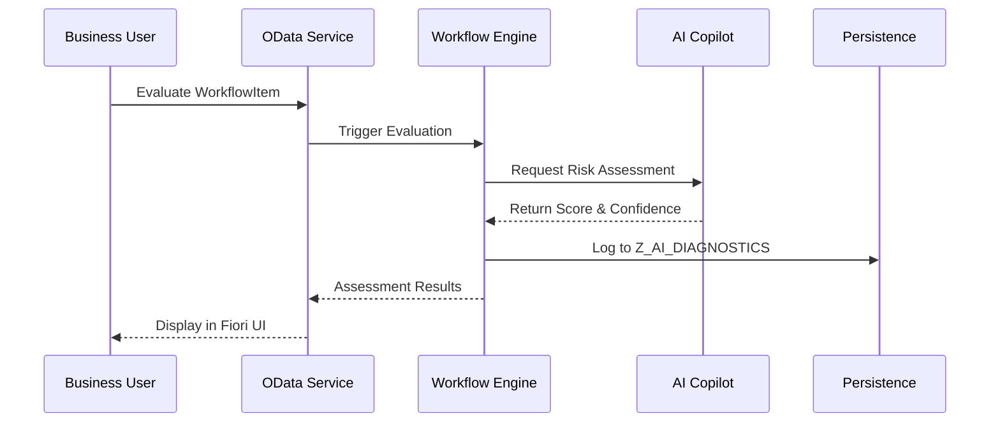

# AI Governance and Compliance Architecture

The **SAP Cognitive Workflow Orchestra** embeds AI within the workflow without compromising enterprise security or auditability.

## AI Copilot Integration
The AI Copilot acts as a specialized assistant within the Fiori Approval Center. It provides context to the `ApprovalUser` but does not execute decisions autonomously without human-in-the-loop validation, adhering to SAP's trustworthy AI principles.

## Traceability & Auditing
Every AI prediction or evaluation (e.g., Risk Intelligence Engine score) is logged into the `Z_AI_DIAGNOSTICS` CDS view, mapped to a specific `WorkflowItem`.

## Architecture Flow

