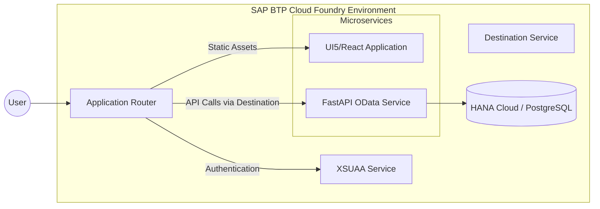

# SAP BTP Deployment Architecture

This document describes the deployment architecture for the **SAP Cognitive Workflow Orchestra** onto the SAP Business Technology Platform (BTP) Cloud Foundry environment.

## Overview

## Cloud Foundry Artifacts
- **`mta.yaml`**: Multi-target application descriptor defining the frontend, backend, and service dependencies (XSUAA, Destination).
- **`xs-security.json`**: Security descriptor defining scopes and role templates for the platform (e.g., `WorkflowAdmin`, `ApprovalUser`).

## Deployment Strategy
The platform is packaged as an MTA archive (`.mtar`) and deployed using the Cloud MTA Build Tool (`mbt`) and the CF CLI (`cf deploy`).
