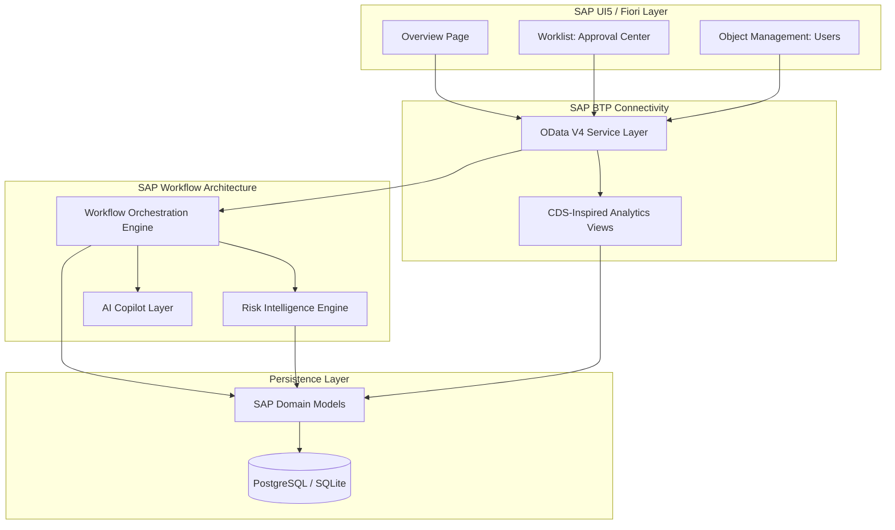

# SAP Cognitive Workflow Orchestra: System Architecture

## Target Architecture

### Components:
- **Presentation**: OpenUI5 integrated into React shell, providing authentic Fiori design elements.
- **Service**: FastAPI acting as an OData V4 compliant service provider, facilitating `$filter`, `$skip`, and `$top` operations.
- **Orchestration**: Core Python engine mapping state transitions to SAP Build Process Automation concepts.
- **Intelligence**: AI modules assessing risk and providing copilot functionalities, seamlessly integrated into the approval workflow.
- **Persistence**: Relational database leveraging SQLAlchemy with CDS-style view wrappers (`Z_...`).
