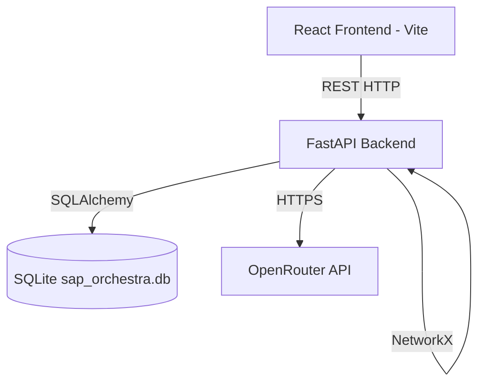

# Current Architecture

## 1. System Overview
The current system is a React-based single-page application communicating with a Python FastAPI backend over REST.

## 2. Component Diagram

## 3. Data Models (SQLAlchemy)
- **Workflow**: Core entity tracking status, department, priority.
- **Task**: Approval tasks linked to a workflow.
- **User**: System users with role, department, and approval authority.
- **Notification**: Alert history.
- **Analytics**: System-wide performance metrics.

## 4. Key Limitations
- Lacks SAP BTP compliance.
- Does not utilize SAP CDS or OData V4 standards.
- No OpenUI5 Fiori applications.
