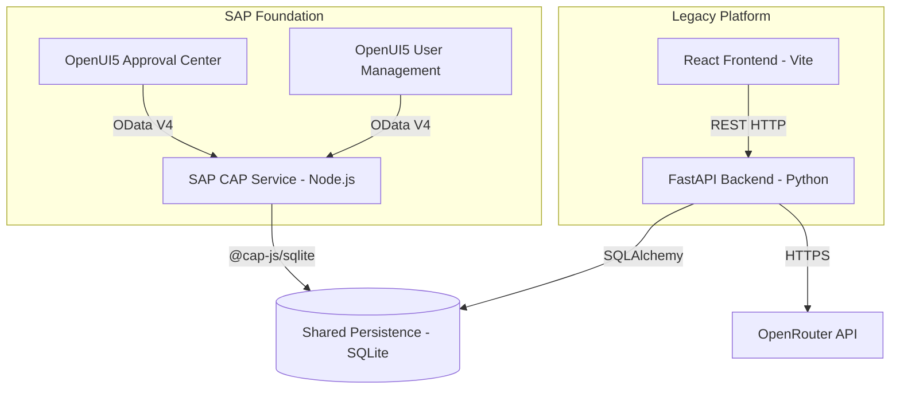

# Target SAP Architecture

## 1. System Overview
The target architecture introduces an authentic SAP Foundation layer consisting of SAP CAP (Node.js), OData V4, CDS modeling, and OpenUI5 Fiori apps, deployed alongside the existing legacy React/FastAPI stack.

## 2. Component Diagram

## 3. Core Deliverables
- **SAP CAP (`/sap-cap`)**: Exposes true OData V4 services via `workflow-service.cds`.
- **CDS Data Model**: Definitive source for entity schemas in `schema.cds`.
- **OpenUI5 Apps**:
  - `/ui5-approval-center`: Managing queue, SLA, risks.
  - `/ui5-user-management`: Role and department assignment.
- **SAP BTP Deployment Assets**: `mta.yaml` and Cloud Foundry deployment configuration.
